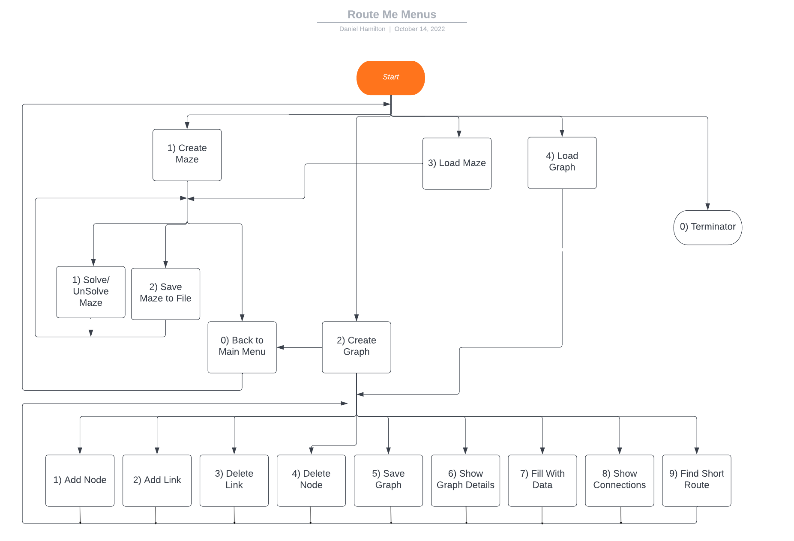
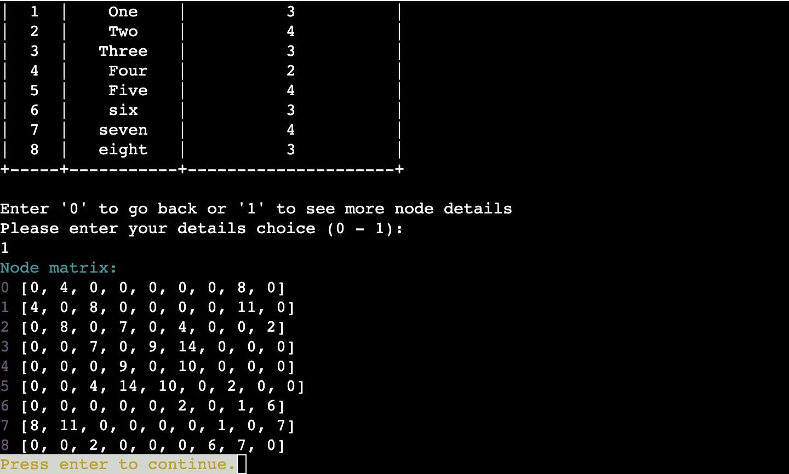

# Route Me

Route me is a python terminal program, which runs in the CI mock terminal on Heroku.
<br>
Users can create a graph and find the shortest route to a target they can also work out the minimum spanning tree. Users can also create a maze, they can choose to solve it them self or use the program to show them the correct path.

Click here to use the program here: [Route Me](https://route-me-dh.herokuapp.com/)

<br>


## About Route-Me

### What is a maze?
#### Definition
A maze is a path or collection of paths, typically from an entrance to a goal. The word is used to refer both to branching tour puzzles through which the solver must find a route.
#### Solving
Maze solving is the act of finding a route through the maze from the start to finish. Some maze solving methods are designed to be used inside the maze by a traveler with no prior knowledge of the maze, whereas others are designed to be used by a person or computer program that can see the whole maze at once.
<br>
In this program you can:

- Create a maze. 

- See the solution to a maze.

- Try and solve a maze.

- Save a maze to come back to solve it later.


### What is a graph? 
#### Definition
A Graph is a non-linear data structure consisting of vertices and edges. The vertices and edges are sometimes also referred to as nodes and links. links are lines or arcs that connect any two nodes in the graph. 
<br>
Each link/edge will have a weight, they can also have a direction. This could be the distance, cost, time taken to get from one node to another. Below are some graph examples to help understand graphs and also how this program can be used. 
<br><br>
*Maps Navigation*<br>
It can be used to find the quickest route to a destination. An example would be that Nodes would be junctions and the links/edges would be roads. The edges could have directions and the weights can be the time it takes to get to the next junction. This can then work out the quickest path too get from the start to the destination.
<br><br>
*Social Media Links*<br>
This could be used to store each user as a node and the links/edges would be the realtionship between users. This could then be able to see how many degrees of separation you have from certain users and then suggest other users to connect to based on the connections you currently have.
<br><br>
*World Wide Web & Networks*<br>
The web can be seen as a collection of documents connected with hyperlinks. A web page could be a node and a link/edge could be the hyperlinks.
<br>
You could also connect a network together, consisting of routers and computers. You could then work out the shortest path to send packets over a network. The nodes will be the routers and computers. The links will be the connections and the weight could be the time it takes the packet to travel. The other use could be to work out the minimum amount of connections needed to connect all the computers and routers in the network. 
<br><br>
*Product Recommendations (Advertisting)*<br>
This use for the graph could be used to recommend products to users. The nodes could be customers or products and the links are connections to these products. The graph could then find users with simliar node links and see what products are not in the users links and recommned these products to the user.

For example - User A could click on a link to a pair of shoes, they then click on an advert linking to a hat and then click on a link to a bag that was on the site. 

User B could then view the same shoes as user A, the system will then recommend the hat as a link becuase a previous user looking at the same product clicked on it.  
<br>
It could also track adverts and recommened product clicks. The nodes can be products and the link is the hyperlink to another product that was shown on the webpage. The clicks can be tracked and the weight for each link will be how many times that linked was clicked from the previous page (node). This will allow a comapny to work out what products are getting a lot of attention and what items are working well as being advertised from one page to another.
<br><br>
*London Tube Map*<br>
The london tube map can have the stations as nodes and the lines/ tracks as links/edges. You can then work out the quickest route from one stop to another. You could also work out alternative routes if a station is closed. an example of this is stored in Google sheets. Load in "tube_map" to use the zone 1 and 2 London tube map example. 

-----

## How to use it

This program is designed to help you find the quickest way from a start position to a destination. It can also create and solve mazes. When you start the program you will be taken to the Main menu. Use the instructions and image below to help navigate.
<br>

### Main Menu

#### Option 1 - Create Maze
This will generate a random new maze. It will ask for a name and a size then create a maze with the dimensions entered.
Will the take you to the create maze menu (option 1).
#### Option 2 - Create Graph
This will create a empty graph. It will ask for a name for your graph.
Will the take you to the create graph menu (option 2).
#### Option 3 - Load Maze
This will show a list of all saved mazes and ask you to enter the name of the maze you want to load.
Will the tak you to the create maze menu (option 1).
#### Option 4 - Load Graph
This will show a list of all saved graphs and ask you to enter the name of the graph you want to load.
Will the tak you to the create graph menu (option 2).
#### Option 0 - Exit
This will terminate the program.

<br>

### Option 1 - Create Maze
#### Option 1 - Solve /Unsolve Maze
This will show the path to get from the start of the maze to the other. If they maze has already been solved it will remove the path.
#### Option 2 - Save Maze
This will save the maze to a google sheets file.
#### Option 0 - Back to Main Menu
This will take you back to the main menu.

<br>

### Option 2 - Create Graph
#### Option 1 - Add Node
This will add a node to the graph, it will ask for a name for the node.
#### Option 2 - Add Link
This will cretae a link between two nodes. It will ask for the name of the start connection and the name of the end. It will then ask for the weight for the connections. 
#### Option 3 - Delete Link
This will delete a link between two nodes. It will ask for the name of the start connection and the name of the end and set the link to 0.
#### Option 4 - Delete Node
This will remove a node from the graph and all its connections, It will ask for the name of the node to remove. 
#### Option 5 - Save Graph
This will save the graph to a google sheets file.
#### Option 6 - Show Graph Details
This will show the name of the graph, the name of the nodes and all the connections in the graph matrix. 
#### Option 7 - Fill With Sample Data
This will create a graph with test data in the nodes and connections. 
#### Option 8 - Show Connections
This will show all teh connections for one node. It will ask you to enter the name of the node.
#### Option 9 - Find Shortest Route
This will find the shortest path between two node. It will ask for the names of the start and end. Itw ill then find the route and list out the steps.
#### Opion 10 - Minimum Spanning Tree
This will create a link between all the nodes but will make sure it uses the minium amount of link weight to do it. 
#### Option 0 - Back to menu
This will take you back to the main menu.

<br>

### User Assistance
- "h" - The user can type 'h' in any menu to get a definition or information about all of the options in the menu.
- "123" - The user can type '123' in any graph option that requires the user to enter a nodes name. This will show all the names of the nodes that are currently in the graph. this will help the user remember the names that are in the graph. 


### Navigaton Flowchart

<br>



***

## User Story
|Story No.|Story|
| ------------- | ------------- |
|1| As a user, <br> I want to be able to create a randomly genrated maze <br> so that I can see how good i am at solving them. <br><br>I know I am done when a maze is shown in the console |
|2|As a user, <br> I want to be able to choose the size of my maze <br> so that I can control the difficulty of the maze.<br><br>I know I am done when users can enter a size and a maze appears in theose dimensions.|
|3|As a user, <br> I want to be able to solve the maze<br> so that I can get the path to solve the maze. <br><br> I know I am done when a path is shown on the maze.|
|4|As a user,<br> I want to be able to save a maze <br> so that I can use it in another program or come back to it. <br> <br> I know I am done when google sheets can view a maze.|
|5|As a user,<br> I want to be able to load a maze <br> so that I can come back to it and edit it. <br> <br> I know I am done when a user can view a worksheet from google sheets.|
|6|As a user,<br> I want to be able to create a graph <br> so that I can plan a route. <br> <br> I know I am done when a user can view all the connetions in an array.|
|7|As a user,<br> I want to be able to find the shorest path between two nodes <br> so that I can find a quick route. <br> <br> I know I am done when a user can view all the steps to get from one node to another.|
|8|As a user,<br> I want to be able to save a graph <br> so that I can use it in another program or come back to it. <br> <br> I know I am done when google sheets can view a maze.|
|9|As a user,<br> I want to be able to load a graph <br> so that I can come back to it and edit it. <br> <br> I know I am done when a user can view a worksheet from google sheets.|
|10|As a user,<br> I want to be able to edit a graph <br> so that I can change it to my prefernces. <br> <br> I know I am done when a user can add and delete nodes, they will also be able to add and delete connections.|
|11|As a user,<br> I want to be able to create a Minimum Spanning Tree <br> so that I can connect all the nodes with the least amount of weight. <br> <br> I know I am done when a user can see all the connections in the Minimum Spanning Tree.|
|12|As a user,<br> I want to be able to solve a maze by stepping though and solving it my self <br> so that I can see if I have the ability to solve a maze. <br> <br> I know I am done when a user can press directions and it travels through the maze.|

## Features

### Menus
The main menu is the first screen you will interact with. The user will choose from 5 options in a numerical menu:


The maze menu is the menu which shows all the things yoiu can do to a maze once it is created. The user will choose from 4 options in a numerical menu:


The graph menu is the menu which shows all the things yoiu can do to a graph once it is created. The user will choose from 10 options in a numerical menu:


### Help Messages
On the menu you can press 'h' which will show the help message to give more information for the user. It gives a better understanding on all the terms and key words.


### Create Maze
The user can give the maze a name and then set the size of the maze. Once a name that starts with a letter has been entered and a maze size between 10 and 40 has been entered it will create the maze. the maze is created using a random prims algorithm.

**Prims Algorithm**
Start with a grid full of walls.
Pick a random cell, mark it as part of the maze. Add the walls of the cell to the wall list.
While there are walls in the list:
    Pick a random wall from the list. If only one of the two cells that the wall divides is visited, then:
        Make the wall a passage and mark the unvisited cell as part of the maze
        Add the neighboring walls of the cell to the wall list.
    Remove the wall from the list


### Solve maze/ Unsolve maze
Option 1 in the maze menu will work out the path to complete the maze. It uses a recursive method to check all possible routes until it reaches the exit of the maze. It uses a depth-first approach.

```python
def __create_path(self, path, current, last, goal):
        '''
        recursive method to find a path to the exit point in the
        maze returning the path it took.

        Parameters
        ----------
        path: int[]
            steps taken to get to the exit
        current: int[]
            current position in the maze
        last: int[]
            the position in the maze it has left
        goal: int[]
            the exit to the maze

        Returns
        -------
        path: int[]
            steps to the exit
        '''
        new_path = []

        if current == goal:
            path.append(current)
            return path

        for count in range(4):
            if count == 0:
                current_coord = current[0]
                maze_edge = 0
            if count == 1:
                current_coord = current[1]
                maze_edge = 0
            if count == 2:
                current_coord = current[1]
                maze_edge = self.maze_size-1
            if count == 3:
                current_coord = current[0]
                maze_edge = self.maze_size-1

            if current_coord != maze_edge:
                next_path = self.__set_next_path(count, current)
                if next_path != last:
                    if self.maze[next_path[0]][next_path[1]] != self.__wall:
                        temp_path = self.__create_path([], next_path, current,
                                                       goal)
                        if len(temp_path) > len(new_path):
                            new_path = temp_path
                            new_path.append(current)
        return new_path
```


### Save a maze
Option 2 of the menu will save the maze to google sheets. It takes the name of the maze and create a new worksheet with the same name then will pass the array maze data to the sheets. 


### Load a maze
Option 3 in the main menu will show all the available sheets that can be loaded. The user will then be able to enter the sheet name, then the maze will be loaded in.
 


### Create Graph
Once a name that starts with a letter has been entered it will create the graph.


### Add node
Can add a node to the graph. It will ask the user to enter the name for the node and will check to make sure it doesnt alredy exist in the graph.


### Add/edit link
Can add a link between to nodes. It will ask for the name of the first node then the name of the second node. once it has validated both names it will ask the user to enter the weight between the nodes then finally create the link.


### Delete node
This will remove the node from the graph and all links associated to it. it will ask the user for the name of the node to remove.


### Delete link
Can remove a link between to nodes. It will ask for the name of the first node then the name of the second node. once it has validated both names it will set the link weight to 0.


### Show graph
This will show all the details for the graph and will ask the user if they want to view the complete matrix. The user can press '0' to go back to the menu or '1' to view the full matrix.


If option 1 is selected by the user it will show the matrix like below:


### Show connections for one node
Will ask the user to enter the name of the node they want to view. It will then show all the weights and connections for the node.


### Find the Shortest Path

using the Dijkstras algorithm it will find the shortest path from a start location to the end. 

The Pseudo code I used to design the methods are below. 

This will find the total distance from the start node to the end.
```
 1  function Dijkstra(Graph, source):
 2      
 3      for each vertex v in Graph.Vertices:
 4          dist[v] ← INFINITY
 5          prev[v] ← UNDEFINED
 6          add v to Q
 7      dist[source] ← 0
 8      
 9      while Q is not empty:
10          u ← vertex in Q with min dist[u]
11          remove u from Q
12          
13          for each neighbor v of u still in Q:
14              alt ← dist[u] + Graph.Edges(u, v)
15              if alt < dist[v]:
16                  dist[v] ← alt
17                  prev[v] ← u
18
19      return dist[], prev[]
```

This prints out the path that was taken to get to the destination. 
```
1  S ← empty sequence
2  u ← target
3  if prev[u] is defined or u = source:          // Do something only if the vertex is reachable
4      while u is defined:                       // Construct the shortest path with a stack S
5          insert u at the beginning of S        // Push the vertex onto the stack
6          u ← prev[u]                           // Traverse from target to source
```

These can be seen in the GameGraph class in methods "dijkstra_path" and "__print_short_path"

#### dijkstra_path

```python
    def dijkstra_path(self):
        '''
        find the shortest path to a node

        Parameters
        ----------
        None

        Returns
        -------
        None
        '''
        start_name = input("Please enter the name of the start node:\n")
        start_name_index = self.__get_node_index(start_name)
        if start_name_index != -1:
            end_name = input("Please enter the name of the "
                             "destination node:\n")
            end_name_index = self.__get_node_index(end_name)
            if end_name_index != -1:

                total_distance = [sys.maxsize] * len(self.graph_node_names)
                previous_node = [None] * len(self.graph_node_names)
                total_distance[start_name_index] = 0
                visited = [False]*len(self.graph_node_names)

                for _ in range(len(self.graph_node_names)):
                    min_number = sys.maxsize

                    for node in range(len(self.graph_node_names)):
                        if total_distance[node] < min_number and \
                                visited[node] is False:
                            min_number = total_distance[node]
                            min_index = node
                    current_node = min_index

                    visited[current_node] = True

                    for node in range(len(self.graph_node_names)):
                        if self.graph_nodes[current_node][node] > 0 and \
                            visited[node] is False and \
                            total_distance[node] > \
                                total_distance[current_node] + \
                                self.graph_nodes[current_node][node]:
                            total_distance[node] = \
                                total_distance[current_node] + \
                                self.graph_nodes[current_node][node]
                            previous_node[node] = current_node
                self.__print_short_path(total_distance, previous_node,
                                        start_name_index, end_name_index,
                                        visited[end_name_index])
            else:
                print(negative_text_color("Error: Name not found in graph"))
        else:
            print(negative_text_color("Error: Name not found in graph"))

```

#### __print_short_path
```python
def __print_short_path(self, total_distance, previous_node, start_index,
                           end_index, reachable):
        '''
        write out the instructions on how to follow the shortest path

        Parameters
        ----------
        total_distance: int
            the total distance of the path
        previous_node: int
            index of the node that was last visited
        start_index: int
            index of the start node
        end_index: int
            index of the end node
        reachable: boolean
            true if the start and end have a path to link

        Returns
        -------
        None
        '''
        clear_terminal()
        print(heading_text_color("Quickest route"))
        if reachable is True:
            print(f"{self.graph_node_names[start_index]} to "
                  f"{self.graph_node_names[end_index]} has "
                  f"weight of {total_distance[end_index]} "
                  )
            the_node = end_index
            print()
            print(highlight_text_color("The steps to destination"))
            solution = []
            solution_name = []
            while the_node != start_index:
                solution.insert(0, the_node)
                solution_name.insert(0, self.graph_node_names[the_node])
                the_node = previous_node[the_node]
            solution_name.insert(0, self.graph_node_names[start_index])
            print(solution_name)
            last = start_index
            print()
            for index, node in enumerate(solution):
                print(f"{index+1}) {self.graph_node_names[last]} to "
                      f"{self.graph_node_names[node]} ("
                      f"{'weight = '}"
                      f"{highlight_text_color(self.graph_nodes[last][node])})")
                last = node
        else:
            print(negative_text_color(
                f"There is no route between "
                f"{self.graph_node_names[start_index]} and "
                f"{self.graph_node_names[end_index]}"))
        print()
```


### Quick ffill Graph with sample data
This will add sample data to the graph. 
The sample data is shown below
```python
self.graph_node_names = ["Zero", "One", "Two", "Three", "Four", "Five",
                                 "six", "seven", "eight"]
        self.graph_nodes = [[-1, 4, 0, -1, -1, -1, -1, 8, -1],
                            [4, -1, 8, -1, -1, -1, -1, 11, -1],
                            [0, 8, -1, 7, -1, 4, -1, -1, 2],
                            [-1, -1, 7, -1, 9, 14, -1, -1, -1],
                            [-1, -1, -1, 9, -1, 10, -1, -1, -1],
                            [-1, -1, 4, 14, 10, -1, 2, -1, -1],
                            [-1, -1, -1, -1, -1, 2, -1, 1, 6],
                            [8, 11, -1, -1, -1, -1, 1, -1, 7],
                            [-1, -1, 2, -1, -1, -1, 6, 7, -1]
                            ]
```


### Save a graph
Option 5 of the menu will save the graph to google sheets. It takes the name of the graph and creates a new worksheet with the same name then will pass the array graph data to the sheets. If the user has attemped to solve the maze it will also pass the current coordinate of where the user is up to.


### Load a graph
Option 4 in the main menu will show all the available sheets that can be loaded. The user will then be able to enter the sheet name. Then the graph will be loaded in.


### Live solving for maze
Option 3 in the maze menu allows the user to solve a maze. They can use WASD to control the direction and draw a path in the maze. 


### Minimum Spanning Tree
Option 10 in the graph menu creates a spanning tree. A spanning tree means all nodes must be connected and they must be connected with the minimum weight link to make it a Minimum Spanning Tree.
<br>

#### The Test data

#### The Results

#### The Expected Outcome


### Display Nodes
When a user needs to type in a node name, they can type in '123' to see all the node names that are currently in the graph. They allow the user to see what names are in the graph and get the right spelling. 


***

## Refactor Improvements

### Graph Structure Improvement
In the orignal matrix storage for the grpah the non existant connectsion were storered by puting the value of 0 in the connection space. This caused an issue as some connections to a niode could have the value of 0. The code was editied and changed so that nodes that do not have links are now represnted using -1 as the value.

#### New data example


## Future features

### Key Press
The game would be improved by having a key listerner that will allow the user to press a key to move around the maze rather than having to press enter after every command. This is something that could be added in the future to give the user a smoother interaction with maze solving. 

### Maze Shape
Currently the maze for the program will need to be a square, the maze could be designed by having a different width and height. This could give the user more design possabilities to their maze. 

### Maze Start & End
The user may want to change where the start and end of the maze is. This will give the user more design possabilities to their maze.

### Maze Create Custom Maze
The user can create a maze using the google sheets maze. The program could be improved by allowing the user to create a maze within the program.

### Graph Display
The program could benefit from giving the user the option to see a drawn graph. This will be difficult to do in the terminal but something that can be added in the future to improve UX. It will show the user a visual display of the graph so they can get a better understanding of the spanning tree and shortest path.

***

## Class diagram


***

## Modules and Libraries 
### Modules
- run.py
- game_maze.py
- game_graph.py
- util.py
- program_help.py

### Libraries
- cachetools==5.2.0
- colorama==0.4.5
- evdev==1.6.0
- google-auth==2.13.0
- google-auth-oauthlib==0.5.3
- gspread==5.6.0
- gspread-formatting==1.1.1
- keyboard==0.13.5
- oauthlib==3.2.2
- prettytable==3.4.1
- pyasn1==0.4.8
- pyasn1-modules==0.2.8
- pynput==1.7.6
- python-xlib==0.31
- requests-oauthlib==1.3.1
- rsa==4.9
- termcolor==2.0.1

***

## Data modeling
The google sheet has a required worksheet to store the names of the saved mazes and graphs. It will add worksheets when a new graphs or maze has been saved. The name of the google sheet is "route_me_data"

<br>


### "saves" worksheet
saves is a worksheet that stores the names of the mazes and graphs. When the user wants to load in a sheet it will read in the names. Column A contains all the maze names and column b has all the graph names. This is appened to when a user saves a new file. 


### Maze worksheet
When a maze is being saved it will store the the characters that are in the array to individual cells. The name of the worksheet will be the name of the maze. If the user has attempted to solve the maze then the current coordinate of the solver will also be stored in the last cells in column A and B. A being the X coordinate and B being the Y.


### Graph worksheet
The graph stores all the names of the nodes in row 1. It then stores the connections for each node below the node name.


### Future Improvements

Although Google Sheets enables the program to function and stores the dat that is required it could be made more efficient if the data was saved in a relational database. This is an improvement that can be added in the future.   

***

## Testing

### Manual Testing & User Story Testing
[Click here](TESTING.md) to see the full testing page

### Validatior Testing
The standard testing [PEP8 Online](http://pep8online.com/) is currently down so I used the PEP8 validator extension within gitpod. 
There are 0 critical error.
The 3 warnings shown are related to .gitpod.yml. These warnings are from the template files from Code Institute.


-----

### Solved Bugs

#### variable not used
A warning that kept appearing in my code was that I was looping but not using the variable for example:
```python
for node in range(len(self.nodes)):
    # do something
```

To stop this I was able to use the underscore value so that the warning is removed
```python
for _ in range(len(self.nodes)):
    # do something
```

#### infinity
In my algorithm to find the shortest path I needed to set the weight between the nodes to infinite. I used the import sys so I can use INT_MAX to set it to the max int size. 

***

## Deployment

### Cloning & Forking
#### Fork
1. On GitHub.com, navigate to the [dlhamilton/Route Me](https://github.com/dlhamilton/route-me) repository.
2. In the top-right corner of the page, click Fork.
3. By default, forks are named the same as their parent repositories. You can change the name of the fork to distinguish it further.
4. Add a description to your fork.
5. Click Create fork.

#### Clone
1. Above the list of files click the button that says 'Code'.
2. Copy the URL for the repository.
3. Open Terminal. Change the directory to the location where you want the cloned directory.
4. Type git clone, and then paste the URL
5. Press Enter.

### Local Deployment
1. Sign up to [Gitpod](https://gitpod.io/)
2. Download the Gitpod browser extension.
3. On GitHub.com, navigate to the [dlhamilton/route_me](https://github.com/dlhamilton/route-me) repository.
4. Above the list of files click the button that says 'Gitpod'.
5. Once open you will need to install the libraries, you can do this by typing "pip3 install -r requirements.txt" into the terminal

### Remote Deployment 
 The prgoram was deployed to Heroku. If you have forked/cloned the repository the steps to deploy are:
 1. On Heroku, create a new app.
 2. input a name for your app
 3. Click on the settings tab
 4. Scroll to the Config Vars and click on the "Reveal Config Vars"
 5. Input CREDS into the key field and the content of the Google API creds file into the value area.
 6. Add another config, PORT into key and 8000 into value.
 7. Set the buildbacks to Python and NodeJs in that order .
 8. Link your Heroku app to you repository.
 9. Click on Deploy.
 10. The page will then provide the url to the python terminal.

 The live link can be found here - [Route Me](https://route-me-dh.herokuapp.com/)
### Google Sheet
The program uses a Google Sheets to store saved graphs and mazes. 

1. Sign up to a [Google Account](https://support.google.com/accounts/answer/27441?hl=en#)
2. Open Google Sheets and create a new spreadsheet. [Click here for Google Sheets](https://docs.google.com/spreadsheets/)
3. Change the name of the spreadsheet to 'route_me_data'
    ```python
    SHEET = GSPREAD_CLIENT.open('route_me_data')
    ```
4. You now need to change the name of the worksheet to 'saves'
5. The google sheet is now complete

Now you need to get the API credentials from the [Google Cloud Platform](https://console.cloud.google.com/)

1. Create a new project and give it a name.
2. Select APIs and services from the navigation pane. 
3. Now click Library
4. Search for the Google Sheets and click enable.
5. Search for the google Drive API and click enable.
6. Click create credentials and from the drop down select Google dRIVE api.
7. From the form select Application data
8. Then click No for "are you planning to use this API with compute Engine, Kubernetes engine, App engine or cloud Functions?"
9. Press Create and Continue.
10. Select a role of Editor from the options and click "Done"
11. Navigate to the service account on the credentials page. 
12. On the tab click KEYS then ADD KEY.
13. The Key type will need to be JSON
14. Copy the downloaded JSON file into your repository and name it "creds.json"
15. ADD THE "creds.json" FILE TO .gitignore FILE. DO NOT SHARE PUBLICLY.

***

## Credits / Acknowledgement 

Code instutie for the deployment terminal - 
https://codeinstitute.net/

Used to get the timing for the tube map graph data - 
http://www.london-tubemap.com/assets/tubemap_journey-times_2.pdf

Used to build the title logo for Route-Me - 
https://patorjk.com/software/taag/#p=display&f=Doom&t=Route-Me

The algorithm to work out the shortest path - 
https://en.wikipedia.org/wiki/Dijkstra%27s_algorithm

The algorithm to create the maze. The algorithm used was Prims - 
https://en.wikipedia.org/wiki/Maze_generation_algorithm

This helped me to design my flow charts and class diagrams - 
https://lucid.app/

To show a table in the graph class to show the node details in a easier to read format. - 
https://ptable.readthedocs.io/en/latest/tutorial.html

-----