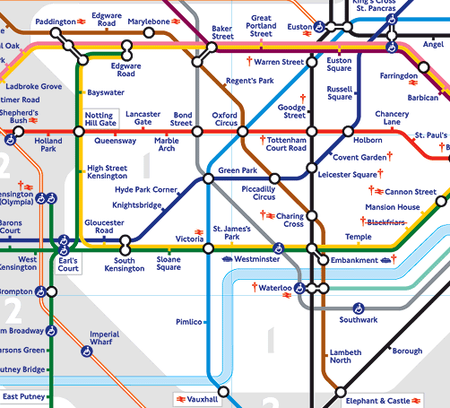
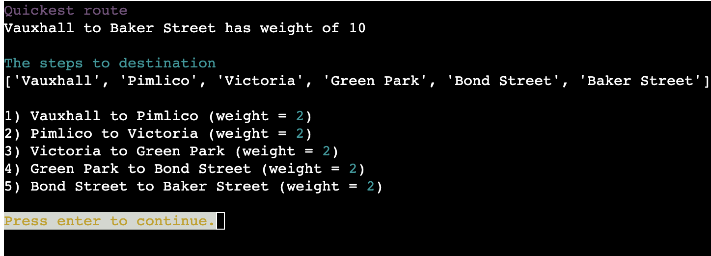

# Route Me Testing

[<< Back to ReadMe](README.md)

## Manual Testing

Below are the test to check all validation and operation of the program.

### Main menu tests
<table>
    <tr>
        <th>Test Number</th>
        <th>Test</th>
        <th>Test data</th>
        <th>Expected result</th>
        <th>Actual result</th>
        <th>Test result</th>
    </tr>
    <tr>
        <td>1</td>
        <td>Program starting</td>
        <td>n/a</td>
        <td>Loads main menu</td>
        <td>Main menu is shown to screen</td>
        <td>Pass</td>
    </tr>
    <tr>
        <td>2</td>
        <td>Main Menu Validation</td>
        <td>Input " "</td>
        <td>Error message</td>
        <td>Error messge and interates the question</td>
        <td>Pass</td>
    </tr>
    <tr>
        <td>3</td>
        <td>Main Menu Validation</td>
        <td>Input "a"</td>
        <td>Error message</td>
        <td>Error messge and interates the question</td>
        <td>Pass</td>
    </tr>
    <tr>
        <td>4</td>
        <td>Main Menu Validation</td>
        <td>Input 20</td>
        <td>Error message</td>
        <td>Error messge and interates the question</td>
        <td>Pass</td>
    </tr>
    <tr>
        <td>5</td>
        <td>Main Menu Validation</td>
        <td>Input "$"</td>
        <td>Error message</td>
        <td>Error messge and interates the question</td>
        <td>Pass</td>
    </tr>
    <tr>
        <td>6</td>
        <td>Main Menu Validation</td>
        <td>Input 0</td>
        <td>exits the program</td>
        <td>shows the exit screen</td>
        <td>Pass</td>
    </tr>
    <tr>
        <td>7</td>
        <td>Main Menu Validation</td>
        <td>Input 1</td>
        <td>Starts to create the maze</td>
        <td>Ask the user for the name of the maze</td>
        <td>Pass</td>
    </tr>
    <tr>
        <td>8</td>
        <td>Main Menu Validation</td>
        <td>Input 2</td>
        <td>Starts to create the graph</td>
        <td>Ask the user for the name of the graph</td>
        <td>Pass</td>
    </tr>
    <tr>
        <td>9</td>
        <td>Main Menu Validation</td>
        <td>Input 3</td>
        <td>Starts to load in a maze</td>
        <td>shows the user all the saved mazes</td>
        <td>Pass</td>
    </tr>
    <tr>
        <td>10</td>
        <td>Main Menu Validation</td>
        <td>Input 4</td>
        <td>Starts to load in a graph</td>
        <td>shows the user all the saved graphs</td>
        <td>Pass</td>
    </tr>
<table>

***

### Maze create tests

<table>
    <tr>
        <th>Test Number</th>
        <th>Test</th>
        <th>Test data</th>
        <th>Expected result</th>
        <th>Actual result</th>
        <th>Test result</th>
    </tr>
    <tr>
        <td>1</td>
        <td>Maze name validating</td>
        <td>Input "test"</td>
        <td>Accepts the name and move to next screen</td>
        <td>asks the user to enter the maze size</td>
        <td>Pass</td>
    </tr>
    <tr>
        <td>2</td>
        <td>Maze name validating</td>
        <td>Input 2</td>
        <td>Error message</td>
        <td>Error messge and interates the question</td>
        <td>Pass</td>
    </tr>
    <tr>
        <td>3</td>
        <td>Maze name validating</td>
        <td>Input ""</td>
        <td>Error message</td>
        <td>Error messge and interates the question</td>
        <td>Pass</td>
    </tr>
    <tr>
        <td>4</td>
        <td>Maze name validating</td>
        <td>Input "£"</td>
        <td>Error message</td>
        <td>Error messge and interates the question</td>
        <td>Pass</td>
    </tr>
    <tr>
        <td>5</td>
        <td>Maze size validating</td>
        <td>Input "£"</td>
        <td>Error message</td>
        <td>Error messge and interates the question</td>
        <td>Pass</td>
    </tr>
    <tr>
        <td>6</td>
        <td>Maze size validating</td>
        <td>Input 0</td>
        <td>Error message</td>
        <td>Error messge and interates the question</td>
        <td>Pass</td>
    </tr>
    <tr>
        <td>7</td>
        <td>Maze size validating</td>
        <td>Input "a"</td>
        <td>Error message</td>
        <td>Error messge and interates the question</td>
        <td>Pass</td>
    </tr>
    <tr>
        <td>8</td>
        <td>Maze size validating</td>
        <td>Input 12</td>
        <td>Build the maze with the correct size</td>
        <td>Tells the user to press enter to see maze</td>
        <td>Pass</td>
    </tr>
</table>

***

### Maze menu tests

<table>
    <tr>
        <th>Test Number</th>
        <th>Test</th>
        <th>Test data</th>
        <th>Expected result</th>
        <th>Actual result</th>
        <th>Test result</th>
    </tr>
    <tr>
        <td>1</td>
        <td>Maze menu validating</td>
        <td>Input "£"</td>
        <td>Error message</td>
        <td>Error messge and interates the question</td>
        <td>Pass</td>
    </tr>
    <tr>
        <td>2</td>
        <td>Maze menu validating</td>
        <td>Input -1</td>
        <td>Error message</td>
        <td>Error messge and interates the question</td>
        <td>Pass</td>
    </tr>
    <tr>
        <td>3</td>
        <td>Maze menu validating</td>
        <td>Input "a"</td>
        <td>Error message</td>
        <td>Error messge and interates the question</td>
        <td>Pass</td>
    </tr>
    <tr>
        <td>4</td>
        <td>Maze menu validating</td>
        <td>Input 1</td>
        <td>If the mave has not been solved will show the path. If it is solved it will remove the path</td>
        <td>Removes and add the solve path at the correct condition</td>
        <td>Pass</td>
    </tr>
    <tr>
        <td>5</td>
        <td>Maze menu validating</td>
        <td>Input 2</td>
        <td>Should save the maze data to google sheets</td>
        <td>Starts the save process</td>
        <td>Pass</td>
    </tr>
    <tr>
        <td>6</td>
        <td>Maze menu validating</td>
        <td>Input 3</td>
        <td>the user can start trying to solve the maze</td>
        <td>Starts the user solving process</td>
        <td>Pass</td>
    </tr>
    <tr>
        <td>7</td>
        <td>Maze menu validating</td>
        <td>Input 0</td>
        <td>Takes the user back to the main menu</td>
        <td>Takes the user back to the main menu</td>
        <td>Pass</td>
    </tr>
</table>

***

### Solve maze tests

<table>
    <tr>
        <th>Test Number</th>
        <th>Test</th>
        <th>Test data</th>
        <th>Expected result</th>
        <th>Actual result</th>
        <th>Test result</th>
    </tr>
    <tr>
        <td>1</td>
        <td>Maze solving</td>
        <td>n/a</td>
        <td>A path is displayed to the user showing the route from the start to the end</td>
        <td>A coloiured line shows up on the maze to sow the user the path</td>
        <td>Pass</td>
    </tr>
    <tr>
        <td>2</td>
        <td>Maze unsolving</td>
        <td>n/a</td>
        <td>A path is removed and the user sees the maze without any paths</td>
        <td>A coloiured line shows up on the maze to sow the user the path</td>
        <td>Pass</td>
    </tr>
<table>

#### Example:

 

***

### Save maze tests
<table>
    <tr>
        <th>Test Number</th>
        <th>Test</th>
        <th>Test data</th>
        <th>Expected result</th>
        <th>Actual result</th>
        <th>Test result</th>
    </tr>
    <tr>
        <td>1</td>
        <td>Saving maze</td>
        <td>Maze with the same name in Google sheet</td>
        <td>Error message and ask for new file name</td>
        <td>Error messge and asks for a new file name</td>
        <td>Pass</td>
    </tr>
    <tr>
        <td>2</td>
        <td>Saving maze - new sheet name</td>
        <td>Input "£"</td>
        <td>Error message</td>
        <td>Error messge and interates the question</td>
        <td>Pass</td>
    </tr>
    <tr>
        <td>3</td>
        <td>Saving maze</td>
        <td>Maze with unique name</td>
        <td>Adds data to Google sheets</td>
        <td>Saved to Google sheets and confirmtion message</td>
        <td>Pass</td>
    </tr>
<table>

***

### User solve tests

<table>
    <tr>
        <th>Test Number</th>
        <th>Test</th>
        <th>Test data</th>
        <th>Expected result</th>
        <th>Actual result</th>
        <th>Test result</th>
    </tr>
    <tr>
        <td>1</td>
        <td>User solve maze</td>
        <td>Maze with the solution shown on the maze</td>
        <td>Error message and shows the menu</td>
        <td>Error messge and teels the user the maze is already solved</td>
        <td>Pass</td>
    </tr>
    <tr>
        <td>2</td>
        <td>User solve maze</td>
        <td>Maze with no solution shown on the maze</td>
        <td>start point shown to user</td>
        <td>Maze shows the users current position in the maze</td>
        <td>Pass</td>
    </tr>
    <tr>
        <td>3</td>
        <td>User direction input</td>
        <td>Input " "</td>
        <td>Error message</td>
        <td>Error messge and interates the question</td>
        <td>Pass</td>
    </tr>
    <tr>
        <td>4</td>
        <td>User direction input</td>
        <td>Input "j"</td>
        <td>Error message</td>
        <td>Error messge and interates the question</td>
        <td>Pass</td>
    </tr>
    <tr>
        <td>4</td>
        <td>User direction input</td>
        <td>Input 20</td>
        <td>Error message</td>
        <td>Error messge and interates the question</td>
        <td>Pass</td>
    </tr>
    <tr>
        <td>5</td>
        <td>User direction input</td>
        <td>Input "$"</td>
        <td>Error message</td>
        <td>Error messge and interates the question</td>
        <td>Pass</td>
    </tr>
    <tr>
        <td>6</td>
        <td>User direction input</td>
        <td>Input "w"</td>
        <td>Move the user up in the maze</td>
        <td>The users current position moves up by one</td>
        <td>Pass</td>
    </tr>
    <tr>
        <td>7</td>
        <td>User direction input</td>
        <td>Input "s"</td>
        <td>Move the user up in the maze</td>
        <td>The users current position moves down by one</td>
        <td>Pass</td>
    </tr>
    <tr>
        <td>8</td>
        <td>User direction input</td>
        <td>Input "a"</td>
        <td>Move the user up in the maze</td>
        <td>The users current position moves left by one</td>
        <td>Pass</td>
    </tr>
    <tr>
        <td>9</td>
        <td>User direction input</td>
        <td>Input "d"</td>
        <td>Move the user up in the maze</td>
        <td>The users current position moves right by one</td>
        <td>Pass</td>
    </tr>
    <tr>
        <td>10</td>
        <td>User direction input</td>
        <td>Input "w" or "a" or "s" or "d" next to a wall</td>
        <td>Error message</td>
        <td>Error messge and interates the question</td>
        <td>Pass</td>
    </tr>
    <tr>
        <td>11</td>
        <td>User direction input</td>
        <td>Input "w" or "a" or "s" or "d" next going over user made path</td>
        <td>Will move the user and remove path left behind</td>
        <td>Clears the path that was left and goes to the correct position</td>
        <td>Pass</td>
    </tr>
    <tr>
        <td>12</td>
        <td>User direction input</td>
        <td>Input 0</td>
        <td>Exits the user solve method</td>
        <td>Goes back to the Maze menu</td>
        <td>Pass</td>
    </tr>
</table>

***

### Graph create tests

<table>
    <tr>
        <th>Test Number</th>
        <th>Test</th>
        <th>Test data</th>
        <th>Expected result</th>
        <th>Actual result</th>
        <th>Test result</th>
    </tr>
    <tr>
        <td>1</td>
        <td>Graph name validating</td>
        <td>Input "test"</td>
        <td>Accepts the name and move to next screen</td>
        <td>Tells the user the Graph is created</td>
        <td>Pass</td>
    </tr>
    <tr>
        <td>2</td>
        <td>Graph name validating</td>
        <td>Input 2</td>
        <td>Error message</td>
        <td>Error messge and interates the question</td>
        <td>Pass</td>
    </tr>
    <tr>
        <td>3</td>
        <td>Graph name validating</td>
        <td>Input ""</td>
        <td>Error message</td>
        <td>Error messge and interates the question</td>
        <td>Pass</td>
    </tr>
    <tr>
        <td>4</td>
        <td>Graph name validating</td>
        <td>Input "£"</td>
        <td>Error message</td>
        <td>Error messge and interates the question</td>
        <td>Pass</td>
    </tr>
</table>

### Graph menu testing

<table>
    <tr>
        <th>Test Number</th>
        <th>Test</th>
        <th>Test data</th>
        <th>Expected result</th>
        <th>Actual result</th>
        <th>Test result</th>
    </tr>
    <tr>
        <td>1</td>
        <td>Graph menu validating</td>
        <td>Input "£"</td>
        <td>Error message</td>
        <td>Error messge and interates the question</td>
        <td>Pass</td>
    </tr>
    <tr>
        <td>2</td>
        <td>Graph menu validating</td>
        <td>Input -1</td>
        <td>Error message</td>
        <td>Error messge and interates the question</td>
        <td>Pass</td>
    </tr>
    <tr>
        <td>3</td>
        <td>Graph menu validating</td>
        <td>Input "a"</td>
        <td>Error message</td>
        <td>Error messge and interates the question</td>
        <td>Pass</td>
    </tr>
    <tr>
        <td>4</td>
        <td>Graph menu validating</td>
        <td>Input 0</td>
        <td>Takes the user back to the main menu</td>
        <td>User is taken to the main menu</td>
        <td>Pass</td>
    </tr>
    <tr>
        <td>5</td>
        <td>Graph menu validating</td>
        <td>Input 1</td>
        <td>Will add a node to the graph array</td>
        <td>ask the user for the new node name</td>
        <td>Pass</td>
    </tr>
    <tr>
        <td>6</td>
        <td>Graph menu validating</td>
        <td>Input 2</td>
        <td>Will add a link weighting between two nodes in the graph array</td>
        <td>will ask the user what is the first node they want to connect</td>
        <td>Pass</td>
    </tr>
    <tr>
        <td>7</td>
        <td>Graph menu validating</td>
        <td>Input 3</td>
        <td>Will delete a link from the graph array</td>
        <td>will ask the user what is the first node they want to remove the connect from</td>
        <td>Pass</td>
    </tr>
    <tr>
        <td>8</td>
        <td>Graph menu validating</td>
        <td>Input 4</td>
        <td>Will delete a node from the graph array</td>
        <td>will ask the user what is the node they want to remove</td>
        <td>Pass</td>
    </tr>
    <tr>
        <td>9</td>
        <td>Graph menu validating</td>
        <td>Input 5</td>
        <td>Should save the graph data to google sheets</td>
        <td>Starts the save process</td>
        <td>Pass</td>
    </tr>
    <tr>
        <td>10</td>
        <td>Graph menu validating</td>
        <td>Input 6</td>
        <td>Should show all the graph information</td>
        <td>shows the name and node names of the graph</td>
        <td>Pass</td>
    </tr>
    <tr>
        <td>11</td>
        <td>Graph menu validating</td>
        <td>Input 7</td>
        <td>Will put sample data into the graph array</td>
        <td>Puts data into the graph</td>
        <td>Pass</td>
    </tr>
    <tr>
        <td>12</td>
        <td>Graph menu validating</td>
        <td>Input 8</td>
        <td>Will start the process for showing the connections with a node</td>
        <td>Will ask the name of the node you want to show the connection of</td>
        <td>Pass</td>
    </tr>
    <tr>
        <td>13</td>
        <td>Graph menu validating</td>
        <td>Input 9</td>
        <td>Will start the process for finding the shortest path between two nodes</td>
        <td>Will ask the name of the node you want to start from</td>
        <td>Pass</td>
    </tr>
</table>

***
### Add node testing
<table>
    <tr>
        <th>Test Number</th>
        <th>Test</th>
        <th>Test data</th>
        <th>Expected result</th>
        <th>Actual result</th>
        <th>Test result</th>
    </tr>
    <tr>
        <td>1</td>
        <td>Graph node validating</td>
        <td>Input "one"</td>
        <td>Accepts the name and says the node was added</td>
        <td>Node added to graph</td>
        <td>Pass</td>
    </tr>
</table>

### Add link testing
<table>
    <tr>
        <th>Test Number</th>
        <th>Test</th>
        <th>Test data</th>
        <th>Expected result</th>
        <th>Actual result</th>
        <th>Test result</th>
    </tr>
    <tr>
        <td>1</td>
        <td>Graph name validating</td>
        <td>Input "a" (name not in graph)</td>
        <td>Error message</td>
        <td>Error message and returned to the graph menu</td>
        <td>Pass</td>
    </tr>
    <tr>
        <td>2</td>
        <td>Graph name validating</td>
        <td>Input "one" (name in graph)</td>
        <td>Ask for name of connecting node</td>
        <td>Ask the user to type in the connecting node</td>
        <td>Pass</td>
    </tr>
    <tr>
        <td>3</td>
        <td>Graph weight validating</td>
        <td>Input -4</td>
        <td>Error message</td>
        <td>Error message and re-ask the question</td>
        <td>Pass</td>
    </tr>
    <tr>
        <td>4</td>
        <td>Graph weight validating</td>
        <td>Input "a"</td>
        <td>Error message</td>
        <td>Error message and re-ask the question</td>
        <td>Pass</td>
    </tr>
    <tr>
        <td>5</td>
        <td>Graph weight validating</td>
        <td>Input 599</td>
        <td>Error message</td>
        <td>Error message and re-ask the question</td>
        <td>Pass</td>
    </tr>
    <tr>
        <td>6</td>
        <td>Graph weight validating</td>
        <td>Input 6</td>
        <td>Adds the link</td>
        <td>Link added to graph and message to confirm</td>
        <td>Pass</td>
    </tr>
</table>

### Delete link testng
<table>
    <tr>
        <th>Test Number</th>
        <th>Test</th>
        <th>Test data</th>
        <th>Expected result</th>
        <th>Actual result</th>
        <th>Test result</th>
    </tr>
    <tr>
        <td>1</td>
        <td>Graph name validating</td>
        <td>Input "a" (name not in graph)</td>
        <td>Error message</td>
        <td>Error message and returned to the graph menu</td>
        <td>Pass</td>
    </tr>
    <tr>
        <td>2</td>
        <td>Graph name validating</td>
        <td>Input "one" (name in graph)</td>
        <td>Ask for name of connecting node</td>
        <td>Ask the user to type in the connecting node</td>
        <td>Pass</td>
    </tr>
    <tr>
        <td>3</td>
        <td>Graph link validating</td>
        <td>n/a</td>
        <td>Link removed from graph</td>
        <td>Link removed from graph and message to confirm</td>
        <td>Pass</td>
    </tr>
    </table>

### Delete node testing
<table>
    <tr>
        <th>Test Number</th>
        <th>Test</th>
        <th>Test data</th>
        <th>Expected result</th>
        <th>Actual result</th>
        <th>Test result</th>
    </tr>
    <tr>
        <td>1</td>
        <td>Graph node validating</td>
        <td>Input "one" (name in graph)</td>
        <td>Accepts the name and says the node was deleted</td>
        <td>Node removed from graph and all links associated with it</td>
        <td>Pass</td>
    </tr>
    <tr>
        <td>2</td>
        <td>Graph node validating</td>
        <td>Input "a" (name not in graph)</td>
        <td>Error message</td>
        <td>Error message and returned to the graph menu</td>
        <td>Pass</td>
    </tr>
</table>

### Save graph testing
<table>
    <tr>
        <th>Test Number</th>
        <th>Test</th>
        <th>Test data</th>
        <th>Expected result</th>
        <th>Actual result</th>
        <th>Test result</th>
    </tr>
    <tr>
        <td>1</td>
        <td>Saving graph</td>
        <td>Graph with the same name in Google sheet</td>
        <td>Error message and ask for new file name</td>
        <td>Error messge and asks for a new file name</td>
        <td>Pass</td>
    </tr>
    <tr>
        <td>2</td>
        <td>Saving graph - new sheet name</td>
        <td>Input "£"</td>
        <td>Error message</td>
        <td>Error messge and interates the question</td>
        <td>Pass</td>
    </tr>
    <tr>
        <td>3</td>
        <td>Saving graph</td>
        <td>Graph with unique name</td>
        <td>Adds data to Google sheets</td>
        <td>Saved to Google sheets and confirmtion message</td>
        <td>Pass</td>
    </tr>
<table>

### Show graph details teting
<table>
    <tr>
        <th>Test Number</th>
        <th>Test</th>
        <th>Test data</th>
        <th>Expected result</th>
        <th>Actual result</th>
        <th>Test result</th>
    </tr>
    <tr>
        <td>1</td>
        <td>Show graph details</td>
        <td>n/a</td>
        <td>The name of the graph and node names shown.</td>
        <td>Details shown to user</td>
        <td>Pass</td>
    </tr>
     <tr>
        <td>3</td>
        <td>Graph show validating</td>
        <td>Input 1</td>
        <td>Will show the graph matrix</td>
        <td>Shows all the graphs details in the matrix</td>
        <td>Pass</td>
    </tr>
    <tr>
        <td>4</td>
        <td>Graph show validating</td>
        <td>Input 0</td>
        <td>Will go back to the menu</td>
        <td>Goes back to the menu</td>
        <td>Pass</td>
    </tr>
    <tr>
        <td>4</td>
        <td>Graph show validating</td>
        <td>Input "d"</td>
        <td>Error message</td>
        <td>Error message and asks the question again</td>
        <td>Pass</td>
    </tr>
</table>
 

Example:

If option 1 is selected by the user it will show the matrix like below:

### Fill sample data testing
<table>
    <tr>
        <th>Test Number</th>
        <th>Test</th>
        <th>Test data</th>
        <th>Expected result</th>
        <th>Actual result</th>
        <th>Test result</th>
    </tr>
    <tr>
        <td>1</td>
        <td>Fill the graph with sample data</td>
        <td>n/a</td>
        <td>The graph adds the data that is hard coded</td>
        <td>Correct data is added to the graph and message to confirm</td>
        <td>Pass</td>
    </tr>
</table>

### Show connections testing
<table>
    <tr>
        <th>Test Number</th>
        <th>Test</th>
        <th>Test data</th>
        <th>Expected result</th>
        <th>Actual result</th>
        <th>Test result</th>
    </tr>
    <tr>
        <td>1</td>
        <td>Graph node validating</td>
        <td>Input "one" (name in graph)</td>
        <td>Accepts the name and shows the links associated with the node</td>
        <td>All the links to the node are shown with the weights.</td>
        <td>Pass</td>
    </tr>
    <tr>
        <td>2</td>
        <td>Graph node validating</td>
        <td>Input "a" (name not in graph)</td>
        <td>Error message</td>
        <td>Error message and returned to the graph menu</td>
        <td>Pass</td>
    </tr>
</table>

### Find shortest route testing
<table>
    <tr>
        <th>Test Number</th>
        <th>Test</th>
        <th>Test data</th>
        <th>Expected result</th>
        <th>Actual result</th>
        <th>Test result</th>
    </tr>
    <tr>
        <td>1</td>
        <td>Graph name validating</td>
        <td>Input "a" (name not in graph)</td>
        <td>Error message</td>
        <td>Error message and returned to the graph menu</td>
        <td>Pass</td>
    </tr>
    <tr>
        <td>2</td>
        <td>Graph name validating</td>
        <td>Input "one" (name in graph)</td>
        <td>Ask for name of connecting node</td>
        <td>Ask the user to type in the connecting node</td>
        <td>Pass</td>
    </tr>
    <tr>
        <td>3</td>
        <td>Graph name validating</td>
        <td>Input "two" (name in graph)</td>
        <td>show the quickest path</td>
        <td>shows the quickest path with the nodes it needs to take</td>
        <td>Pass</td>
    </tr>
</table>

 

Example:

### Load maze testing
<table>
    <tr>
        <th>Test Number</th>
        <th>Test</th>
        <th>Test data</th>
        <th>Expected result</th>
        <th>Actual result</th>
        <th>Test result</th>
    </tr>
    <tr>
        <td>1</td>
        <td>Shows saved mazes</td>
        <td>n/a</td>
        <td>Shows all the mazes from Google sheets</td>
        <td>Shows the saved mazes and ask the user to enter the sheet name they want to open</td>
        <td>Pass</td>
    </tr>
    <tr>
        <td>2</td>
        <td>Saved mazes name validation</td>
        <td>name in Google sheets</td>
        <td>Loads the maze in</td>
        <td>Maze data is loaded from Google sheets and maze menu is shown</td>
        <td>Pass</td>
    </tr>
    <tr>
        <td>3</td>
        <td>Saved mazes name validation</td>
        <td>Name not in Google sheets</td>
        <td>Error message</td>
        <td>Error message and goes back to the main menu</td>
        <td>Pass</td>
    </tr>
</table>

### Load graph testing
<table>
    <tr>
        <th>Test Number</th>
        <th>Test</th>
        <th>Test data</th>
        <th>Expected result</th>
        <th>Actual result</th>
        <th>Test result</th>
    </tr>
    <tr>
        <td>1</td>
        <td>Shows saved graphs</td>
        <td>n/a</td>
        <td>shows all the graphs from Google sheets</td>
        <td>Shows the saved graphs and ask the user to enter the sheet name they want to open</td>
        <td>Pass</td>
    </tr>
    <tr>
        <td>2</td>
        <td>Saved graphs name validation</td>
        <td>name in Google sheets</td>
        <td>Loads the maze in</td>
        <td>Maze data is loaded from Google sheets and maze menu is shown</td>
        <td>Pass</td>
    </tr>
    <tr>
        <td>3</td>
        <td>Saved graphs name validation</td>
        <td>name not in Google sheets</td>
        <td>Error message</td>
        <td>Error message and goes back to the main menu</td>
        <td>Pass</td>
    </tr>
</table>

### Help message testing
<table>
    <tr>
        <th>Test Number</th>
        <th>Test</th>
        <th>Test data</th>
        <th>Expected result</th>
        <th>Actual result</th>
        <th>Test result</th>
    </tr>
    <tr>
        <td>1</td>
        <td>Shows help message</td>
        <td>Input 'h' on main menu</td>
        <td>Shows the help message for the main menu</td>
        <td>The main menu help is shown</td>
        <td>Pass</td>
    </tr>
    <tr>
        <td>2</td>
        <td>Shows help message</td>
        <td>Input 'h' on maze menu</td>
        <td>Shows the help message for the maze menu</td>
        <td>The maze menu help is shown</td>
        <td>Pass</td>
    </tr>
    <tr>
        <td>3</td>
        <td>Shows help message</td>
        <td>Input 'h' on graph menu</td>
        <td>Shows the help message for the graph menu</td>
        <td>The graph menu help is shown</td>
        <td>Pass</td>
    </tr>
</table>
-----

## User Story Testing

|Story No.|Result|Story/ Evidence|
| ------------- | ------------- | ------------- |
|1|Test Pass| As a user,   I want to be able to create a randomly genrated maze   so that I can get see how good i am at solving them.   I know I am done when a maze is shown in the console   Evidence: The user can open the high score modal and it loads the scores from local storage.  |
|2|Test Pass|As a user,   I want to be able to choose the size of my maze   so that I can control the difficulty of the maze.  I know I am done when users can enter a size and a maze appears in theose dimensions.  Evidence: The user can open the high score modal and it loads the scores from local storage.  |
|3|Test Pass|As a user,   I want to be able to solve the maze  so that I can get the path to solve the maze.    I know I am done when a path is shown on the maze.  Evidence: The user can open the high score modal and it loads the scores from local storage.  |
|4|Test Pass|As a user,  I want to be able to save a maze   so that I can use it in another program or come back to it.     I know I am done when google sheets can view a maze.  Evidence: The user can open the high score modal and it loads the scores from local storage.  |
|5|Test Pass|As a user,  I want to be able to load a maze   so that I can come back to it and edit it.     I know I am done when a user can view a worksheet from google sheets.  Evidence: The user can open the high score modal and it loads the scores from local storage.  |
|6|Test Pass|As a user,  I want to be able to create a graph   so that I can plan a route.     I know I am done when a user can view all the connetions in an array.  Evidence: The user can open the high score modal and it loads the scores from local storage.  |
|7|Test Pass|As a user,  I want to be able to find the shorest path between two nodes   so that I can find a quick route.     I know I am done when a user can view all the steps to get from one node to another.  Evidence: The user can open the high score modal and it loads the scores from local storage.  |
|8|Test Pass|As a user,  I want to be able to save a graph   so that I can use it in another program or come back to it.     I know I am done when google sheets can view a maze.  Evidence: The user can open the high score modal and it loads the scores from local storage.  |
|9|Test Pass|As a user,  I want to be able to load a graph   so that I can come back to it and edit it.     I know I am done when a user can view a worksheet from google sheets.  Evidence: The user can open the high score modal and it loads the scores from local storage.  |
|10|Test Pass|As a user,  I want to be able to edit a graph   so that I can change it to my prefernces.     I know I am done when a user can add and delete nodes, they will also be able to add and delete connections.  Evidence: The user can open the high score modal and it loads the scores from local storage.  |